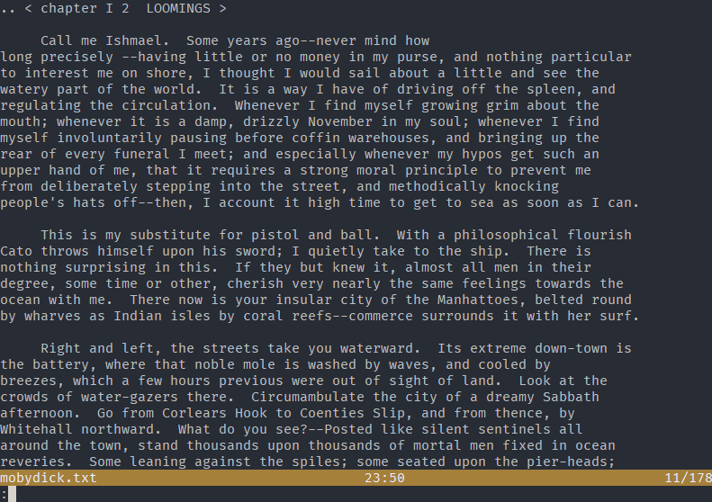

# spellshock.vim

Try to guess the original word from a vim spell checker suggestion.



## installation

Using vim-plug:

```
Plug 'alligator/spellshock.vim'
```

Other plugin managers may vary.

## usage

Run `:Spellshock` to play.

## why did you make this

The vim spell checker can get pretty buck wild when you run it on correctly spelt words:

```
Change "alligator" to:
1 "Alligator"
2 "alligators"
3 "allocator"
4 "Alli gator"
5 "alligator's"
...
31 "Alfi gator"
32 "Calli gator"
33 "Dalli gator"
34 "Halli gator"
35 "Kalli gator"
...
51 "abrogator"
52 "collimator"
53 "pollinator"
54 "allegation"
55 "also gator"
```

I noticed this one day, wrote "vim spell checker guessing game" on my list of project ideas, and here we are.
